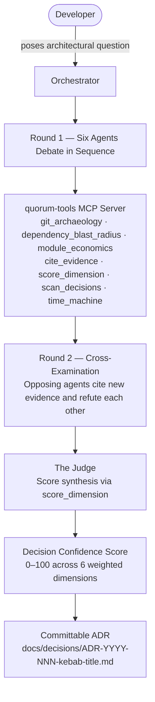
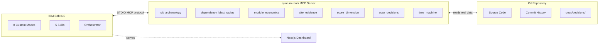

# QUORUM

```
  ██████  ██    ██  ██████  ██████  ██    ██ ███    ███
 ██    ██ ██    ██ ██    ██ ██   ██ ██    ██ ████  ████
 ██    ██ ██    ██ ██    ██ ██████  ██    ██ ██ ████ ██
 ██ ▄▄ ██ ██    ██ ██    ██ ██   ██ ██    ██ ██  ██  ██
  ██████   ██████   ██████  ██   ██  ██████  ██      ██
```

**The first adversarial tribunal for software architecture decisions.**

7 specialized AI agents debate your hardest technical decisions — with opposing mandates, cited evidence, and a verdict you can commit to your repo.

[](https://www.ibm.com/bob)
[](LICENSE)
[](mcp-server/)
[](web/)
[](mcp-server/src/tools/)
[](https://www.ibm.com/bob)

<!-- DEMO GIF: insert council-debate.gif here -->

---

## 🔴 The Problem

### Every engineering team makes architecture decisions in the dark.

The decision to migrate to microservices gets made by the senior engineer who talks the loudest in the meeting. The decision to keep the monolith gets made by whoever has the most institutional memory. Neither argument is backed by the actual git history, the actual blast radius, the actual break-even timeline — because gathering that evidence takes hours a team does not have. The result: architecture decisions made on vibes, not evidence.

Tribal knowledge is the invisible technical debt. When the engineer who introduced the Java inventory service in 2026 leaves the company, the next engineer doesn't know *why* it was added, *why* it was abandoned thirteen days later, or *why* its commit message says "But it is not visibile in the frontend." That knowledge lives in Slack threads, in someone's memory, or nowhere. When the same mistake gets made eighteen months later, the post-mortem will say "we didn't have documentation." They're right. Nobody had time to write it.

A bad architecture decision costs between $50,000 and $500,000 in rework, rollback operations, regression incidents, and compounding technical debt. Yet the average team spends under two hours debating a decision that will govern their codebase for five years. The Architecture Decision Record was designed to fix this — and almost nobody writes them, because producing a real ADR requires multi-perspective analysis that no single engineer has time to do alone.

> **Tools today generate documentation AFTER the decision. QUORUM debates it BEFORE.**

---

## 🏛️ The Solution

### QUORUM is a multi-agent tribunal, not a chatbot.

When you face a high-stakes architectural decision, you open IBM Bob and type one command:

```
/council Should we consolidate the Java inventory service into the Python backend?
```

QUORUM convenes a Council of 7 specialized agents. Each agent reads the actual repository — the real code, the real git history, the real dependency graph. They debate across three structured rounds, citing specific `file:line` references and commit hashes. Then The Judge synthesizes the evidence into a **Decision Confidence Score** (0–100) and a **committable Architecture Decision Record**.

The ADR goes directly into your repository. The decision is documented, reproducible, and auditable — not because someone had time to write it, but because QUORUM generated it from real evidence.

### 🏛️ The Council — Structured dissent, not committee consensus

Seven agents with **opposing mandates** debate every decision:

| Agent | Mandate | Primary Evidence Sources |
|-------|---------|--------------------------|
| 🛡️ **The Conservative** | Defend the status quo. Prove stability. | Commit churn, test coverage, last-modified dates |
| 🔥 **The Reformer** | Prosecute the case for change. Find the rot. | TODOs, recurring bug patterns, deprecation warnings |
| 📜 **The Historian** | Excavate the git record. Surface precedents. | Commit history, abandoned branches, past reverts |
| 💰 **The Economist** | Invoice the decision. Calculate break-even. | LOC counts, dev-hours, 3-year ROI, $80/h rate |
| ⚠️ **The Risk Officer** | Map blast radius. Quantify danger. | Dependency graph, critical path analysis, failure scenarios |
| 🔧 **The Engineer** | Assess pure technical feasibility. | Stack versions, interface changes, migration patterns |
| ⚖️ **The Judge** | Synthesize evidence. Produce the verdict. | All of the above — via `score_dimension` MCP tool |

**The Evidence Rule:** Every factual claim must cite `file:line` or a verified `commit hash`. If an agent cannot cite evidence, they must declare "No evidence found." The Judge flags uncited arguments as inadmissible and reduces their weight in the score. Speculation is disqualified.

### ⚔️ Cross-Examination — A trial, not a report

After Round 1, agents are paired against their ideological opponents in **Round 2**:

- **Conservative ↔ Reformer** — Status quo defense meets case for change
- **Historian ↔ Engineer** — Past failure patterns meet current technical feasibility
- **Economist ↔ Risk Officer** — Cost calculation meets blast radius assessment

Each agent must directly quote their opponent's strongest evidence and explain why it does not hold. Agents mark their final position: `[MAINTAIN]`, `[REVISE]`, or `[CONCEDE]`. Positions can shift. The DCS updates accordingly.

This is what separates QUORUM from a chatbot that agrees with you: the Conservative is *required* to push back on the Reformer. Every position is stress-tested before the verdict.

### 🔮 The Time Machine — Predictive validation

QUORUM can simulate what it would have advised **before** a historical decision was made. Using the `time_machine` MCP tool, it checks out the parent commit, captures a repository snapshot, runs the six-agent analysis, and produces a predicted DCS — then validates every prediction against the actual git record that followed.

This is not a retrospective summary. It is a reproducible proof that adversarial analysis works: every concern the Council would have raised, the git history confirms.

---

## ⚙️ How It Works

### Council Protocol



### Architecture Stack



---

## 📊 The Decision Confidence Score

Every QUORUM verdict includes a DCS — a weighted aggregate of 6 dimensions, each scored 0–100 by The Judge using the `score_dimension` MCP tool.

| Dimension | Weight | What It Measures |
|-----------|--------|-----------------|
| Evidence Strength | **20%** | Quality and citation density of evidence across all 6 agents |
| Historical Precedent | **15%** | Relevant git history: migrations attempted, reverts, abandoned branches |
| Economic Viability | **20%** | Break-even timeline, 3-year ROI, cost of status quo |
| Risk Assessment | **20%** | Blast radius of change — inverted (100 = low risk, 0 = extreme danger) |
| Technical Feasibility | **15%** | Stack compatibility, breaking interfaces, migration complexity |
| Council Consensus | **10%** | Alignment across the 6 agent positions after cross-examination |

**Verdict thresholds:**

| DCS Range | Verdict |
|-----------|---------|
| 80 – 100 | ✅ **PROCEED** |
| 60 – 79 | ⚠️ **PROCEED WITH CONDITIONS** |
| 40 – 59 | 🔄 **DEFER** |
| 0 – 39 | ❌ **DO NOT PROCEED** |

**Real result — Council Session #1:** ADR-2026-001 scored **69.0/100** → PROCEED WITH CONDITIONS.

---

## 🤝 Built on IBM Bob

### QUORUM is only possible because of IBM Bob.

Every layer of QUORUM's architecture is a Bob extension mechanism working in concert. This is not a wrapper around a generic API — this is a system architected from the ground up around Bob's specific capabilities.

| Bob Capability | How QUORUM Uses It |
|----------------|-------------------|
| **8 Custom Modes** | The 7 Council agents + The Oracle, each with a distinct `roleDefinition`, `mandate`, `customInstructions`, and `groups` (MCP permissions). Agents are isolated — The Conservative cannot access The Judge's synthesis tools. |
| **Custom MCP Server** | `quorum-tools`: 7 purpose-built TypeScript tools Bob invokes during live debates. All tools read the actual repository — no mocked data, no summarized context. |
| **Orchestrator Mode** | Coordinates the 3-phase Council protocol across all agents in sequence: Round 1 → Round 2 → Verdict. The Orchestrator tracks evidence citations and hands off between agents. |
| **5 Skills** | `council-debate`, `cross-examination`, `generate-adr`, `score-decision`, `cite-evidence` — reusable protocols Bob follows for each phase of the debate. |
| **4 Slash Commands** | `/council`, `/ask-historian`, `/verdict`, `/export-session` — single-command triggers for full multi-agent workflows. |
| **Full Repository Context** | Agents cite real `file:line` references and commit hashes because Bob has full codebase access. A generic API call cannot do this — it requires the complete repository context Bob maintains. |
| **Rules Files** | `evidence-first.md` enforces the citation standard across all modes. Uncited claims are flagged inadmissible. |
| **The Oracle Mode** | Proactive governance: The Oracle scans the full repository using `scan_decisions` and surfaces the architectural questions the team *should* be debating — before problems escalate. |

> **Bob doesn't just write code for QUORUM. Bob IS QUORUM's reasoning engine.**

---

## 🖥️ Live Demo — Three Views

The QUORUM web dashboard visualizes repository health, live council debates, and ADR history across three fully interactive views.

```bash
cd web && npm install && npm run dev
# Open http://localhost:3000
```

### Dashboard
Repository health at a glance: QUORUM Health Score gauge, 4-dimension health bars (Decision Quality, Tribal Knowledge Risk, Reverted Decisions, Tribunal Coverage), ADR list with DCS bars and inline markdown preview, and full Decision Confidence Score breakdown.

<!-- SCREENSHOT: docs/assets/dashboard.png -->

### Council Chamber
Watch the debate unfold in real time: 6 agents activate sequentially with typewriter arguments, Round 2 cross-examination cards reveal with VS layout, The Judge synthesizes and the DCS gauge animates to the final score. Skip-to-verdict for demos. Evidence sidebar shows live commit citations.

<!-- SCREENSHOT: docs/assets/council-chamber.png -->

### Time Machine
Three-node timeline: Decision Point (commit `aba26aa`, the self-reported failure), Quorum's Prediction (DCS 19/100, DO NOT PROCEED, 6 flagged concerns), Git Record Confirms (5/5 predictions validated). Every card cites a real commit hash.

<!-- SCREENSHOT: docs/assets/time-machine.png -->

---

## 📋 Case Study — The Galaxium Java Service Decision

### QUORUM in action: the real debate that produced ADR-2026-001

**The question:** Should the Java `inventory_hold_service` be consolidated into the Python `booking_system_backend`?

**The context:** The Java service was introduced on April 10, 2026 with commit `aba26aa` — whose own message reads: *"added java service. But it is not visibile in the frontend."* Three days later, a Python proxy workaround was committed (`10d8576`). The service was merged via PR #9 (`8f7ad7f`) despite unresolved integration failures, renamed six days later (`59f9b46`), and bypassed by all subsequent feature development (`4156ec0`). Total lifecycle: 13 days.

**Round 1 — Six agents, six perspectives:**

| Agent | Stance | Key Finding |
|-------|--------|-------------|
| 🛡️ Conservative | **OPPOSE** | 13-day failure suggests implementation issues, not flawed architecture — the boundary was sound |
| 🔥 Reformer | **SUPPORT** | Java service never deployed; $400/year Python maintenance with zero integration overhead |
| 📜 Historian | **SUPPORT** | 5-commit lifecycle: introduction → failure → workaround → renaming → bypass. Pattern is unambiguous |
| 💰 Economist | **DEFER** | −44.4% 3-year ROI; cannot calculate avoided dual-service cost; Java service was never deployed |
| ⚠️ Risk Officer | **SUPPORT** | Consolidation eliminated cross-service HTTP failures; blast radius is `booking.py` → 10 consumers at criticality 58/100 |
| 🔧 Engineer | **SUPPORT WITH CAVEATS** | Python/FastAPI capable; but `booking.py:7-54` lacks hold/quote/expiry state machine — technically incomplete |

**Round 2 — Cross-examination:**

- **Conservative vs Reformer:** Split — both MAINTAIN. Reformer proved `commit 10d8576` integrated hold workflow into Python. Conservative proved `commit 4156ec0` shows continued development without hold-state implementation.
- **Historian vs Engineer:** Historian holds. "Architecturally correct but technically incomplete" describes `aba26aa` at merge time — the same phrase cannot justify a new incomplete decision.
- **Economist vs Risk Officer:** Both MAINTAIN. Economist proved the Java service was never deployed (phantom risks). Risk Officer proved the blast radius of `booking.py` is real today regardless of past deployment status.

**Verdict:** PROCEED WITH CONDITIONS — **DCS 69.0/100**

| Dimension | Score | Weight | Contribution |
|-----------|-------|--------|--------------|
| Evidence Strength | 82/100 | 20% | 16.4 |
| Historical Precedent | 85/100 | 15% | 12.75 |
| Economic Viability | 35/100 | 20% | 7.0 |
| Risk Assessment | 85/100 | 20% | 17.0 |
| Technical Feasibility | 50/100 | 15% | 7.5 |
| Council Consensus | 83/100 | 10% | 8.3 |
| **TOTAL** | | | **69.0** |

**Five binding conditions** were issued: implement hold/expiry state machine in `booking.py`, add `hold_expiry` and `quote_id` to the Booking model, extend `BookingOut` schema, document race condition handling, and quantify avoided dual-service costs.

---

### The Time Machine — What QUORUM would have said on April 9, 2026

Before commit `aba26aa` was applied, the repository had 3,405 LOC across a single Python service. The commit would add 26 Java files, a Spring Boot application, and a `PythonBackendClient.java` that called back to the Python backend — a circular HTTP dependency with no routing configuration in the snapshot.

**Predicted DCS: 19/100 → DO NOT PROCEED**

Six concerns flagged before the first line of Java code:

1. No problem statement — zero commits document why Python is insufficient
2. Circular dependency — `PythonBackendClient.java` creates bidirectional HTTP coupling
3. No routing configuration — frontend cannot reach the Java service without nginx or an API gateway (absent from snapshot)
4. No integration tests — the service cannot be validated
5. No API contract — no documented interface between services
6. No break-even analysis — 26 Java files added with no economic justification

**Validation against the actual git record:**

| Predicted Concern | Git Evidence | Result |
|-------------------|--------------|--------|
| Frontend integration would fail | `aba26aa`: *"not visibile in the frontend"* | ✅ CONFIRMED |
| Service would require remediation | `10d8576`: Python proxy workaround 3 days later | ✅ CONFIRMED |
| Merged despite unresolved issues | `8f7ad7f`: PR #9 merged April 16 | ✅ CONFIRMED |
| Naming/organizational churn | `59f9b46`: directory renamed April 20 | ✅ CONFIRMED |
| Subsequent work bypasses Java service | `4156ec0`: next feature developed in Python only | ✅ CONFIRMED |

**5 of 5 concerns confirmed.** The tribunal would have blocked this decision with a 19/100 DCS two weeks before the commit message had to admit the failure in writing.

Full ADRs: [ADR-2026-001](docs/decisions/ADR-2026-001-java-service-consolidation.md) · [ADR-2026-000 (Counterfactual)](docs/decisions/ADR-2026-000-counterfactual-java-introduction.md)

---

## 🚀 Quickstart

```bash
# 1. Clone the repository
git clone https://github.com/jpablortiz96/quorum-by-bob.git
cd quorum-by-bob

# 2. Clone the demo repository (Galaxium Travels)
powershell -ExecutionPolicy Bypass -File scripts/clone-demo-repo.ps1

# 3. Build the MCP server
cd mcp-server
npm install
npm run build
cd ..

# 4. Open in IBM Bob IDE
# File → Open Folder → quorum-by-bob
# The 8 custom modes load automatically from .bob/custom_modes.yaml
# The MCP server loads from .bob/mcp.json

# 5. Run the web dashboard
cd web
npm install
npm run dev
# Open http://localhost:3000

# 6. Convene your first Council
# In Bob IDE, switch to Orchestrator mode and run:
# /council [your architectural question]
#
# Or switch to The Oracle mode to discover what decisions
# your repository needs:
# (The Oracle runs scan_decisions automatically)
```

**To run a council session manually:**
1. Switch to **The Conservative** mode → state the decision question → receive Round 1 defense
2. Switch to **The Reformer** mode → receive Round 1 case for change
3. Continue through Historian, Economist, Risk Officer, Engineer
4. Switch to **The Judge** mode → `/verdict` → receive DCS + committable ADR

Or use the Orchestrator to automate the full 3-round flow.

---

## 📁 Project Structure

```
quorum-by-bob/
│
├── .bob/                          # IBM Bob IDE configuration
│   ├── custom_modes.yaml          # 8 custom modes (7 Council + The Oracle)
│   ├── mcp.json                   # MCP server registration + tool permissions
│   ├── modes/                     # Per-agent role definitions (detailed)
│   │   ├── conservative.md
│   │   ├── reformer.md
│   │   ├── historian.md
│   │   ├── economist.md
│   │   ├── risk-officer.md
│   │   ├── engineer.md
│   │   └── judge.md
│   ├── skills/                    # Reusable Bob skills (protocols)
│   │   ├── council-debate/        # Round 1 debate protocol
│   │   ├── cross-examination/     # Round 2 adversarial protocol
│   │   ├── generate-adr/          # ADR output format
│   │   ├── score-decision/        # DCS calculation protocol
│   │   └── cite-evidence/         # Citation enforcement
│   ├── commands/                  # Slash commands
│   │   ├── council-start.md       # /council — full session
│   │   ├── ask-historian.md       # /ask-historian — standalone archaeology
│   │   ├── verdict-only.md        # /verdict — Judge only, after round 1+2
│   │   └── export-session.md      # /export-session — serialize to markdown
│   └── rules/
│       ├── evidence-first.md      # Citation enforcement across all modes
│       └── bobcoin-frugal.md      # Tool call economy
│
├── mcp-server/                    # quorum-tools MCP Server (TypeScript)
│   ├── src/
│   │   ├── index.ts               # Tool registry + STDIO transport
│   │   └── tools/
│   │       ├── git_archaeology.ts         # Commit history search + analysis
│   │       ├── dependency_blast_radius.ts # Import graph + criticality scoring
│   │       ├── module_economics.ts        # LOC, cost, ROI calculator
│   │       ├── cite_evidence.ts           # File:line + commit citation formatter
│   │       ├── score_dimension.ts         # DCS dimension scorer
│   │       ├── scan_decisions.ts          # Oracle: full-repo pressure point scan
│   │       └── time_machine.ts            # Safe git checkout + snapshot capture
│   └── dist/                      # Compiled output (git-ignored after build)
│
├── web/                           # Next.js 14.2 dashboard
│   ├── app/
│   │   ├── page.tsx               # Dashboard view
│   │   ├── council/page.tsx       # Council Chamber — 3-phase debate UI
│   │   ├── time-machine/page.tsx  # Time Machine — timeline validation
│   │   └── api/                   # API routes (health, adrs, council, timemachine)
│   ├── components/                # HealthGauge, HealthDimensions, ADRList, Nav...
│   └── lib/                       # adr-parser, council-parser, agents config
│
├── docs/
│   ├── decisions/                 # Committed ADRs
│   │   ├── ADR-2026-001-java-service-consolidation.md   # Council #1 output
│   │   ├── ADR-2026-000-counterfactual-java-introduction.md  # Time Machine output
│   │   └── draft/                 # Round 1 + Round 2 agent reports
│   ├── architecture.md
│   ├── council-protocol.md
│   └── assets/                   # Screenshots and demo media
│
├── bob_sessions/                  # Serialized council sessions
└── scripts/                       # Setup and utility scripts
```

---

## 🛠️ Tech Stack

| Layer | Technology |
|-------|-----------|
| **AI Orchestration** | IBM Bob IDE — Custom Modes, Skills, MCP integration |
| **MCP Server** | Model Context Protocol SDK (TypeScript), STDIO transport |
| **Git Analysis** | simple-git (JS), Node.js child_process for raw git commands |
| **Web Dashboard** | Next.js 14.2, TypeScript, Tailwind CSS, Framer Motion |
| **Runtime** | Node.js 20+ (MCP server), Node.js 24 (dashboard dev) |
| **Design System** | IBM Carbon color palette (#0f62fe, #42be65, #fa4d56, #f1c21b) |
| **ADR Format** | Markdown — committable, diffable, human-readable |

---

## 🗺️ Roadmap

QUORUM is not a hackathon demo. It is a governance primitive that every engineering team needs.

### Phase 1 — Hackathon POC *(Now)*
- ✅ 8 custom Bob modes (7 Council agents + The Oracle)
- ✅ 7-tool MCP server with real git and dependency analysis
- ✅ 3-round council protocol with cross-examination
- ✅ Decision Confidence Score across 6 weighted dimensions
- ✅ Council Session #1 complete: ADR-2026-001, DCS 69.0
- ✅ Time Machine with verified git validation (5/5 predictions confirmed)
- ✅ Next.js dashboard with 3 interactive views

### Phase 2 — Continuous Governance
- **GitHub Action integration** — The Oracle auto-convenes a mini-Council on any PR touching architectural files (`*.java`, `docker-compose.yml`, database migrations, `package.json` major version bumps)
- **Decision history** — persistent DCS tracking so teams can see architectural health trend over time
- **Multi-repo Oracle** — The Oracle scans across service boundaries in a monorepo or microservice fleet
- **Slack/Teams verdict delivery** — council verdict and ADR link posted to the team channel automatically

### Phase 3 — QUORUM Cloud
- **Org-wide architectural health monitoring** — the QUORUM Score as an industry benchmark, like Lighthouse for architecture
- **Decision database** — searchable history of every council session, cross-referenced with git history
- **Team mode** — human engineers can be assigned agent roles alongside AI agents for hybrid councils
- **The QUORUM Score** — a single, auditable metric that investors, CTOs, and acquirers can reference when evaluating an engineering organization's decision-making quality

---

## ⚡ Why QUORUM Wins

| Approach | What It Does | The Gap |
|----------|-------------|---------|
| LLM chatbot wrapper | Answers architecture questions | No structure, no dissent, agrees with the user |
| AI doc generator | Creates documentation | Written AFTER the decision; no evidence standard |
| Static repo analyzer | Reports code metrics | Reports, doesn't decide; no multi-perspective debate |
| Architecture review board | Human experts debate | Expensive, slow, not available at commit time |
| **QUORUM** | **Adversarial tribunal with cited evidence + predictive validation** | **—** |

QUORUM's differentiators are structural, not incremental:

1. **Adversarial mandates** — The Conservative is *required* to oppose the Reformer. This is not optional. A system that only agrees with the user is not a tribunal; it's a rubber stamp.
2. **Evidence-or-silence rule** — Every claim cites `file:line` or a commit hash, or it is struck from the record. This eliminates the hallucination problem at the protocol level.
3. **Cross-examination** — Positions shift under scrutiny. The DCS reflects those shifts. A verdict produced after cross-examination is worth more than one produced after a single round.
4. **Predictive validation** — The Time Machine proves the system works by verifying its predictions against history. QUORUM does not just claim to be useful; it produces verifiable evidence of its own accuracy.
5. **Committable output** — The ADR is a Markdown file in your repository. It goes into git. It has a hash. It survives the engineer who wrote it.

---

## 👤 Team

**Juan Pablo Enríquez Ortiz (Eduky)**
Full-Stack Developer and QUORUM architect.
IBM Bob Hackathon — May 2026

---

## 📄 License

MIT — see [LICENSE](LICENSE)

---

*QUORUM — Stop making architecture decisions alone. Convene the Council.*
