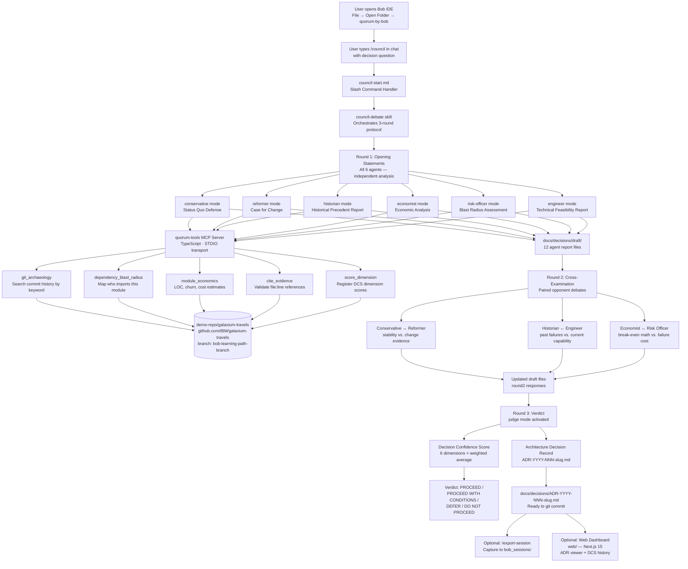

# Quorum — System Architecture

## Full Flow Diagram



## Component Map

### Bob IDE Extension Layer

| Component | Location | Purpose |
|-----------|----------|---------|
| Custom Modes (×7) | `.bob/modes/` | Agent role definitions, output formats, evidence rules |
| Slash Commands (×4) | `.bob/commands/` | `/council`, `/ask-historian`, `/verdict`, `/export-session` |
| Skills (×4) | `.bob/skills/` | `council-debate`, `generate-adr`, `cite-evidence`, `score-decision` |
| Rules (×2) | `.bob/rules/` | `evidence-first`, `bobcoin-frugal` |
| MCP Config | `.bob/mcp.json` | Points to `mcp-server/dist/index.js` via STDIO |

### MCP Server (quorum-tools)

| Tool | Input | Output |
|------|-------|--------|
| `git_archaeology` | keyword, since_date | Commit list with hashes, dates, files changed |
| `dependency_blast_radius` | file_path | Consumer list with criticality scores |
| `module_economics` | directory_path | LOC, churn, cost/ROI estimates |
| `cite_evidence` | claim, file, lines | Validated snippet + formatted citation |
| `score_dimension` | dimension, agent, value, rationale | Running DCS total |

### Document Layer

| Path | Contents |
|------|---------|
| `docs/decisions/draft/` | Work-in-progress agent reports (12 files per session) |
| `docs/decisions/` | Final ADRs (committed, permanent record) |
| `bob_sessions/` | Hackathon submission artifacts (screenshots + markdown exports) |
| `AGENTS.md` | Bob reads this at session start — full council context |

## Data Flow: Evidence Chain

```
Repository file (galaxium-travels)
    → cite_evidence MCP tool (validates file:line exists)
    → Agent report (includes formatted citation)
    → Judge synthesizes citations
    → ADR Evidence Summary table
    → Git commit in quorum-by-bob repo
```

Every piece of evidence in a Quorum ADR traces back to a specific, verifiable line of code or commit hash in the target repository.

## Bobcoin Budget Allocation

```
Total budget: 40 Bobcoins

Setup + /init session:          ~2 Bobcoins
First /council demo:            ~2 Bobcoins
Additional council sessions:    ~6 Bobcoins (3 × 2)
Research + iteration:           ~8 Bobcoins
Submission polish:              ~5 Bobcoins
Reserve:                       ~17 Bobcoins
```
